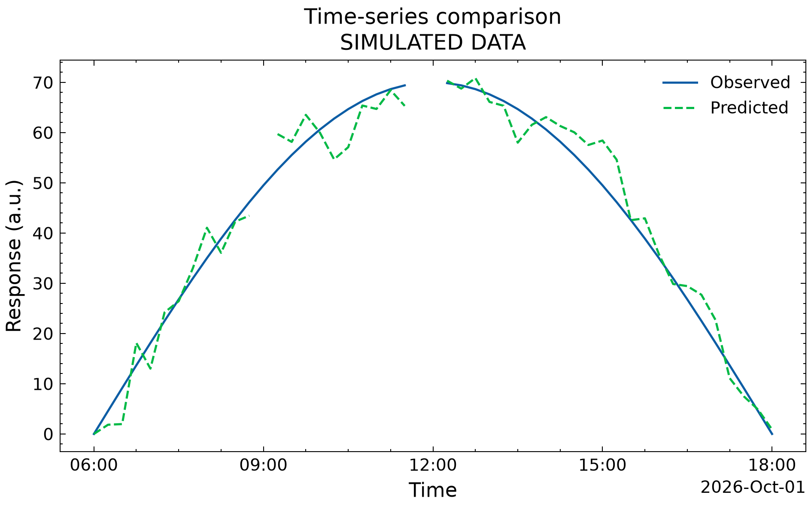

# Research Figure Skill

Turn existing experiment results into clear, reproducible figures; review images and improve Matplotlib code.

[中文](README.md) · [Examples](examples/README.md) · [Contributing](CONTRIBUTING.md)

An Agent Skill for students and researchers preparing papers, presentations and experiment reports. It combines guidance adapted from the [RSS Data Visualisation Guide](https://royal-statistical-society.github.io/datavisguide/) with [SciencePlots](https://github.com/garrettj403/SciencePlots). This is an independent downstream project, not an official product of either upstream.

## What it does

- **Data to figures:** three built-in entry points for time-series comparisons, observed/predicted scatter plots and grouped metric comparisons.
- **Figure review:** an assistant inspects images for axis, legend, typography and communication issues, separating observable problems from unverified claims.
- **Code improvement:** update existing Matplotlib code while preserving the input data and calculation conventions.



All bundled examples are synthetic. `a.u.` means arbitrary units. See [datasets and configurations](examples/README.md) for reproduction.

## Install in Codex

Send this prompt in Codex:

```text
Use skill-installer to install research-figure from:
https://github.com/wjulien888-tech/research-figure-skill/tree/main/skills/research-figure
Then check for Python 3.10+ and install requirements.txt in an isolated .venv
inside the installed skill folder. Do not change global Python packages or
replace an existing skill with the same name.
```

Attach a dataset or provide an accessible local path, then send:

```text
Use $research-figure to compare Method A and Method B in this dataset.
The metric is accuracy (%), grouped by experimental condition.
Prepare a presentation figure and deliver PNG, PDF and reproducible code.
Read the data first and ask about any missing meaning or units.
```

For review, attach an image and ask for issues, locations and suggested fixes. For code improvement, provide the plotting script **and its input data**, then describe the changes. Continue in the same conversation to revise a figure. Users do not need to write JSON or run Python themselves.

Requires Python 3.10+, Matplotlib, NumPy and SciencePlots. No TeX installation is required by default. Non-Latin labels require an installed font covering the characters. Codex is the validated host; compatibility with other Agent Skills hosts has not been tested. See [official skill documentation](https://learn.chatgpt.com/docs/build-skills) for discovery and invocation.

## Standalone quickstart

```bash
git clone https://github.com/wjulien888-tech/research-figure-skill.git
cd research-figure-skill
python3 -m venv .venv
.venv/bin/python -m pip install -r skills/research-figure/requirements.txt
.venv/bin/python skills/research-figure/scripts/plot_csv.py --config examples/timeseries/config.json
```

On Windows, create the environment with `py -3 -m venv .venv` and use `.venv\Scripts\python.exe` instead of `.venv/bin/python`.

Results are written to `work/timeseries/`: PNG, PDF, SVG, scripts, resolved configuration and a rendering log. Existing results are protected; add `--overwrite` to replace them intentionally. CSV is supported directly; Excel requires selecting a sheet and converting it first.

## Boundaries

Time-series gaps remain gaps. Prediction comparisons use a common finite-row mask, identical axis limits and equal aspect. Bar charts retain zero, and error bars must have supplied values and an explicit meaning. Filtering is recorded; the tool does not silently smooth data or invent uncertainty.

A successful render does not validate scientific claims or journal compliance. An assistant must still inspect the exported image. Screenshot-only review cannot validate source values or significance. More complex figures require custom code and case-specific validation.

The repository includes synthetic data only. Keep your research inputs and outputs local; `work/` is ignored. Data provided to an assistant is governed by your chosen host and institutional policies.

## Tests and license

```bash
.venv/bin/python skills/research-figure/tests/test_plot_csv.py
```

The regression suite checks numerical and rendering invariants, including export dimensions and standalone reproduction. It does not establish the quality of every assistant judgment. See [CONTRIBUTING.md](CONTRIBUTING.md) for extension and testing guidance.

Original code: **MIT**. RSS-adapted guidance: **CC BY 4.0**, with attribution and change notices. SciencePlots: **MIT** dependency. See [LICENSE.md](LICENSE.md) and [upstream provenance](skills/research-figure/references/sources.md). No proprietary datasets or third-party fonts are bundled.
