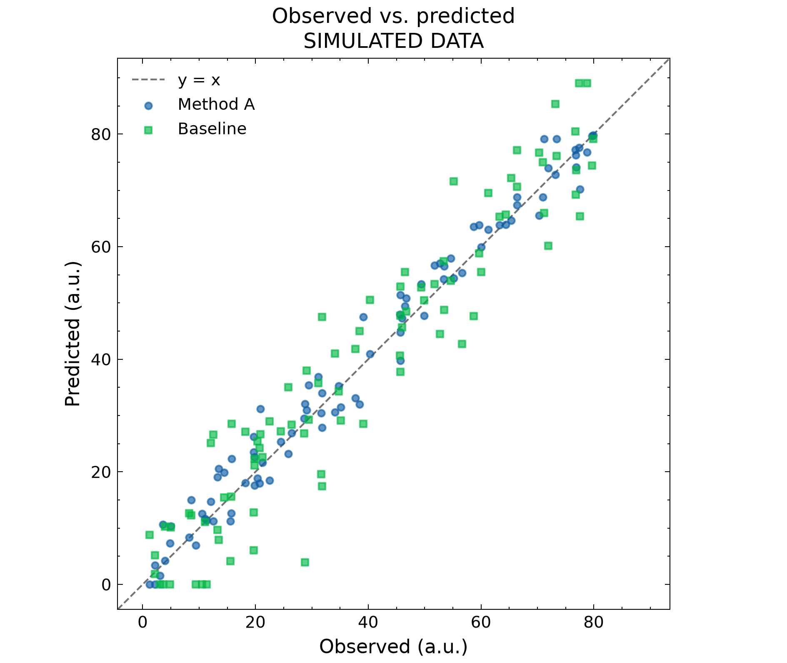
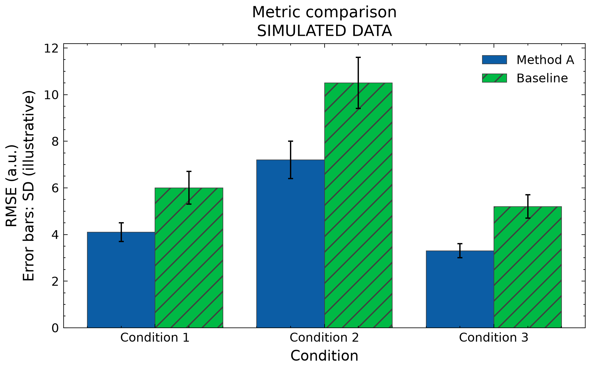

# Research Figure Skill

**把已有实验数据变成清晰、可复现的科研图表，也能检查已有图、改进绘图代码。**

[English](README.en.md) · [详细用法](docs/usage.md) · [示例数据](examples/README.md) · [贡献指南](CONTRIBUTING.md)

适合需要准备论文、组会、课程报告或答辩图表的学生与研究人员。没有预设研究领域；目前内置时间序列对比、预测值与真实值散点图、分条件指标对比三个绘图入口。

这是一套供 AI 编程助手调用的 **Agent Skill**，包含工作说明、检查规则和 Python 工具。当前在 Codex 中验证；也可以独立运行绘图脚本。

## 看看效果

以下均为仓库附带的**模拟数据**，不代表真实方法效果。`a.u.` 表示任意单位。

| 时间序列对比 | 预测值与真实值 | 分条件指标对比 |
|---|---|---|
|  |  |  |

每张图都有对应的 [CSV 和配置](examples/README.md)，可以在本地复现。时间序列示例包含缺失点与时间缺口；散点示例展示共同有效样本的处理。

## 它能帮你做什么

| 你的需求 | 你提供 | 它交付 |
|---|---|---|
| 从数据出图 | 数据文件、比较目标、字段和单位、使用场合 | 图片、绘图代码、配置及处理记录 |
| 检查已有图 | 图片、图注和用途 | 问题位置、依据、修改建议与未核验部分 |
| 改进绘图代码 | Matplotlib 脚本、输入数据、修改目标 | 新版脚本、新图和修改说明 |

图表表达依据来自 [RSS Data Visualisation Guide](https://royal-statistical-society.github.io/datavisguide/)，样式由 [SciencePlots](https://github.com/garrettj403/SciencePlots) 提供。本项目增加了数据核对、缺失处理、视觉检查和复现交付流程；不是两个上游的官方产品。

## 安装到 Codex

在 Codex 对话框发送下面这段话：

```text
请使用 skill-installer，从以下 GitHub 地址安装 research-figure：
https://github.com/wjulien888-tech/research-figure-skill/tree/main/skills/research-figure
安装后，检查 Python 3.10+ 是否可用，并在技能目录的隔离 .venv 环境中
安装 requirements.txt 依赖。不要修改全局 Python 环境或覆盖已有同名技能。
```

安装成功后，在消息中写 `$research-figure` 并描述任务。若没有被识别，可让 Codex 检查技能是否已安装、是否启用；更新未显示时可重启。[官方技能说明](https://learn.chatgpt.com/docs/build-skills)

运行需要 **Python 3.10+、Matplotlib、NumPy、SciencePlots**。默认无需安装 LaTeX。中文图需要本地中文字体；缺失时会报告，不会悄悄把标签换成英文。其他支持 Agent Skills 的工具可参考其安装方式，但兼容性尚未验证。

## 第一次怎么用

**提供文件 → 说清目标 → 补充必要信息 → 获取结果 → 继续修改。**

把文件附在对话里，或给出助手有权读取的本地路径。然后根据任务复制下面一种消息即可。日常使用不需要手写 JSON 或运行终端命令。

### 1. 我有数据，要画图

```text
用 $research-figure 处理附件 results.csv。
我想比较方法 A 和方法 B 在不同实验条件下的准确率，单位是 %。
图用于组会，使用中文标签。先读数据并核对字段，再选择合适图形，
交付 PNG、PDF 和可复现代码。缺少必要信息时问我，不修改原始数据。
```

助手会检查数据结构和单位，生成并查看图片，再交付结果。列名可以自定义；需要转换表格结构时会说明。Excel 请说明工作表，工具读取后再转换。

### 2. 我有图片，要检查

```text
用 $research-figure 检查附件图片，我准备放进论文。
请检查坐标轴、单位、图例、配色和字号，按“位置—问题—建议”列出。
仅凭图片无法判断的内容单独说明。本次只检查。
```

这一步交付审查意见。准确重绘需要原始数据或代码，不能从截图猜造数值。

### 3. 我有代码，要改图

```text
用 $research-figure 改进附件 plot.py，所需数据也已附上。
保留数据处理和指标计算，调整字体、图例和布局；图宽设为 90 mm。
另存新版脚本，交付新图与修改说明，不运行模型训练。
```

拿到图后可以接着说：“把图例移到外面”“改成英文标签”“统一所有图的方法颜色”。更完整的输入示例和输出说明见 [使用指南](docs/usage.md)。

## 不通过 AI 助手，直接试运行

以下为 macOS/Linux 的终端命令。Windows 以 `py -3 -m venv .venv` 创建环境，后续使用 `.venv\Scripts\python.exe` 替代 `.venv/bin/python`。

```bash
git clone https://github.com/wjulien888-tech/research-figure-skill.git
cd research-figure-skill
python3 -m venv .venv
.venv/bin/python -m pip install -r skills/research-figure/requirements.txt
.venv/bin/python skills/research-figure/scripts/plot_csv.py --config examples/timeseries/config.json
```

结果写入 `work/timeseries/`，包括 PNG、PDF、SVG、绘图代码、配置和运行记录。默认不覆盖已有文件；需要重新生成时，在最后一条命令加 `--overwrite`。其他两个示例见 [examples](examples/README.md)。

## 范围与数据原则

- 时间序列保留缺失断线；提供采样间隔时检查整行缺口，不默默插值。
- 多个预测模型默认使用共同有效样本；记录排除行，散点坐标等比例并带 `y=x`。
- 柱图保留零基线；误差线必须来自已提供且说明含义的数值。
- 图片输出后，助手还需要实际查看；脚本运行成功不等于视觉或科学审查通过。
- 不凭空制造数据、误差线或显著性，不为美观擅自改变统计口径。
- 复杂多面板和其他图形可以由助手编写代码，但不属于三个已内置入口。套用样式不能保证满足期刊全部要求。

仓库只含模拟数据。你自己的实验输入和生成目录应留在本地；`work/` 默认不纳入版本控制。数据会由你使用的 AI 工具读取，请按该工具和所在机构的数据规则选择输入。

## 开发与测试

```bash
.venv/bin/python skills/research-figure/tests/test_plot_csv.py
```

测试覆盖缺失值、时间顺序、时区混用、共同样本、柱图基线、误差线、物理导出尺寸、输入不变和独立脚本复现。另附 GitHub Actions 工作流进行测试与模拟出图。测试不覆盖助手的所有选图判断或视觉审查质量。详见 [贡献指南](CONTRIBUTING.md)。

## 许可与致谢

原创代码采用 **MIT**；改编自 RSS 的指南内容采用 **CC BY 4.0** 并保留署名、来源和修改说明。SciencePlots 作为 **MIT** 依赖调用。各部分范围见 [LICENSE.md](LICENSE.md)，精确上游版本见 [来源说明](skills/research-figure/references/sources.md)。链接到的外部资料及用户数据不因本项目而改变许可。
