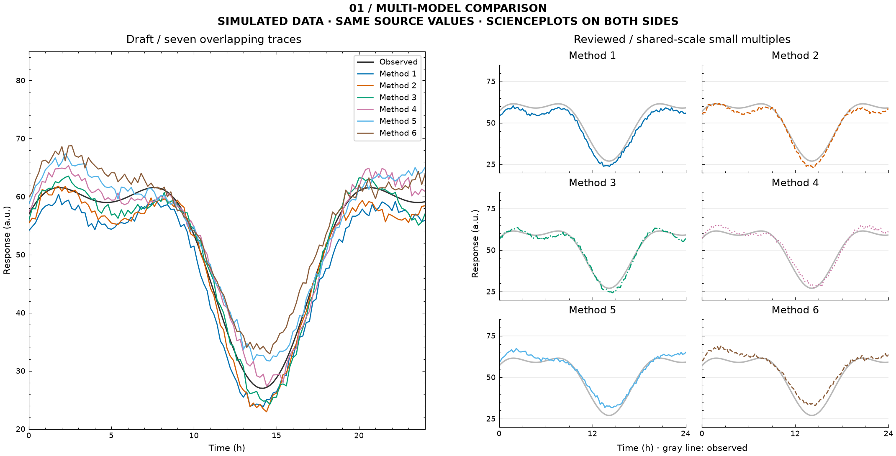
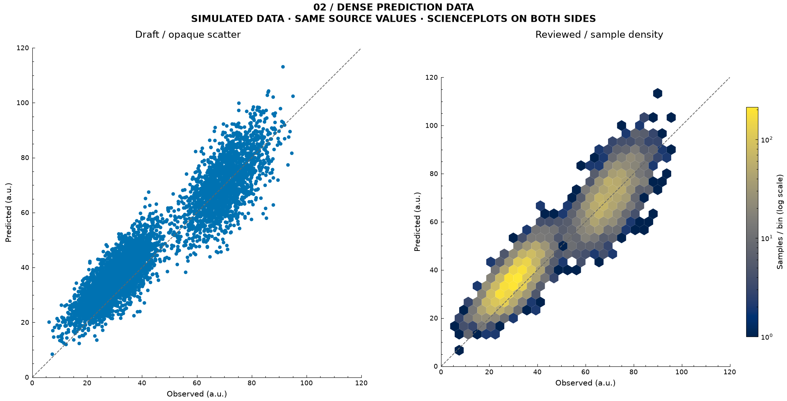
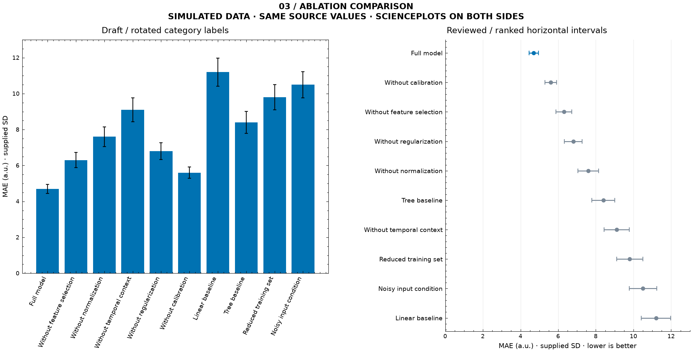
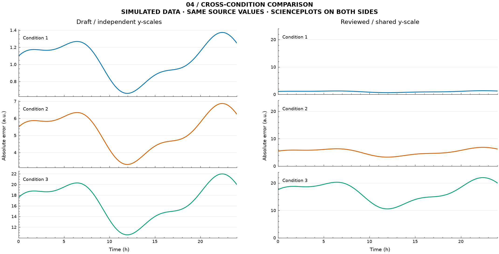

# Research Figure Skill

[](https://github.com/wjulien888-tech/research-figure-skill/actions/workflows/ci.yml)

[](https://github.com/royal-statistical-society/datavisguide)
[](https://github.com/garrettj403/SciencePlots)

**将英国皇家统计学会的数据可视化指南与 SciencePlots 转化为可执行的科研绘图与审查 Skill。**

从实验数据、已有图或绘图代码出发，完成表达审查、图表修订与可复现交付。兼容不同模型与 Agent 工具，不预设学科或数据单位。

[English](README.en.md) · [审查案例](examples/review-case/README.md) · [安装与接入](docs/installation.md) · [使用指南](docs/usage.md) · [贡献指南](CONTRIBUTING.md)

## 上游基础

| 上游项目 | 项目来源 | 本 Skill 的使用方式 |
|---|---|---|
| **[RSS Data Visualisation Guide](https://github.com/royal-statistical-society/datavisguide)** | 英国皇家统计学会发布的《Best Practices for Data Visualisation》 | 将坐标、比例、配色、可访问性和标注原则整理为 12 项可追溯审查规则 |
| **[SciencePlots](https://github.com/garrettj403/SciencePlots)** | John Garrett 等贡献者维护的 Matplotlib 科研绘图样式库 | 使用真实样式依赖完成排版，提供无 LaTeX 默认配置、字体检查与尺寸保留导出 |

在此基础上，本项目增加 **6 项数据与科研约束**，以及共同样本处理、缺失记录、可执行绘图和代码交付。完整映射见 [审查规则](skills/research-figure/references/review-rules.md)，引用版本与许可见 [来源记录](skills/research-figure/references/sources.md)。上方 Stars 徽章展示的是 SciencePlots 上游数据；本项目为独立下游项目。

## 审查案例

**从曲线遮叠、样本分布到多面板比较，修订图表的组织方式，让实验结果更易读、更易比较。**

以下展示 7 组案例中的 5 组。左侧为常见绘图草稿，右侧按 Skill 规则修订；两侧均使用 SciencePlots，改进来自选图、布局与表达审查。全部使用公开的模拟数据，附可复现代码和检查记录。

### 多模型对比：从叠线到共享尺度分面

6 个模型与参考曲线挤在同一坐标轴中，难以逐一追踪。修订后，每个模型与参考曲线单独比较，统一坐标范围，并用标题直接标识模型。



### 密集散点：从遮叠到样本密度

6,000 个不透明散点掩盖了样本集中程度。修订后使用六边形计数呈现密度，区分高密度区域与稀疏区域；保留全部样本、等比例坐标和 `y=x`，明确标注对数色标。



### 消融与基线比较：从旋转标签到排序区间

10 个实验配置的长名称挤占图面，跨组比较需要反复查找。修订为按 MAE 排序的水平点区间图，完整展示名称，突出完整模型，并保留原始指标与所提供的 SD。



### 跨条件比较：从独立坐标到统一尺度

三个条件分别自动缩放时，幅度差异容易被相似形状掩盖。以比较绝对误差大小为目标，修订后共享纵轴，使不同条件的误差水平可以直接比较。



### 指标对比：恢复基线与不确定性

左侧截断柱图基线并省略已有误差线；右侧恢复零基线、展示所提供的 SD，并增加纹理区分。最后一组数值为 **3.3 与 5.2**：截断轴将可见柱长比放大到约 **7.33∶1**；恢复零基线后为原始数值比约 **1.58∶1**。


另外两组案例展示数据口径与缺失处理的修订：

| 案例 | 草稿问题 | 修订结果 |
|---|---|---|
| [预测对比](examples/review-case/README.md#预测对比) | 两个模型分别使用 90/89 个样本；坐标比例不一致 | 统一为 89 个共同有效样本，记录排除行；等比例坐标与 `y=x` |
| [时间序列](examples/review-case/README.md#时间序列) | 缺失点和时间缺口被直接连接 | 保留 1 个缺失预测点及 2 条缺失时间记录形成的断线 |

[完整案例与复现代码](examples/review-case/README.md) 包含七组对照图、规则依据及验证记录。前四组是按 Skill 规则编写的自定义 Matplotlib 示例，后三组调用内置绘图入口。这些案例展示可复现的修订方法，不是模型自动审查能力的对照测评；样本口径需结合数据或代码核验。

## 工作流程

**输入数据或图表 → 核对表达与样本 → 执行修订 → 查看导出结果 → 交付代码与记录**

| 模式 | 输入 | 交付 |
|---|---|---|
| 图表生成 | 数据、字段定义、单位、比较目标 | PNG/PDF/SVG、绘图脚本、配置与处理记录 |
| 图表审查 | 图片、图注；有条件时提供数据和代码 | 问题位置、规则依据、修改建议及核验范围 |
| 代码改进 | Matplotlib 脚本、输入数据、修改要求 | 新版代码、修订图表及变更说明 |

内置时间序列、预测散点和分条件指标三个入口。规则指导模型审查，脚本负责确定性的数据处理与渲染；复杂图形需要另行编写和验证代码。

## 安装与兼容性

项目采用 [Agent Skills](https://agentskills.io/specification) 目录结构，不依赖特定模型 API。可通过以下方式接入：

| 接入方式 | 配置 |
|---|---|
| 支持 Agent Skills 的工具 | 将 `skills/research-figure/` 安装至工具识别的技能目录 |
| 通用大模型对话或自建 Agent | 加载 `SKILL.md` 及相关参考文件；需要出图时提供 Python 执行环境 |
| 独立脚本 | 安装 Python 依赖，按 JSON 配置执行绘图 |

[安装指南](docs/installation.md) 提供 Claude Code、Cursor、Codex 的目录配置，以及通用对话和 API 接入方式。技能指令不绑定模型；文件访问、代码执行和图像查看能力由所用平台提供。已完成 Codex 流程验证及 Python 脚本测试，其他平台的端到端验证待补充。

绘图依赖 Python 3.10+、Matplotlib、NumPy 和 SciencePlots，默认无需 LaTeX。中文标签需要可用的中文字体。

## 使用

加载技能后，提供输入文件及任务要求。以下请求不依赖特定工具的调用语法。

**图表生成**

```text
使用 research-figure，根据 results.csv 比较不同实验条件下方法 A 和方法 B 的准确率（%）。
使用中文标签，输出 PNG、PDF 和可复现代码。核对字段、单位与缺失值，保留原始数据。
```

**图表审查**

```text
使用 research-figure 审查附件图表，检查坐标轴、单位、图例、配色和字号。
列出问题位置、依据与修改建议，并注明仅凭图片无法核验的内容。
```

**代码改进**

```text
使用 research-figure 修改 plot.py，输入数据已附上。
保留数据处理与指标计算，调整字体和布局，图宽设为 90 mm。另存脚本并导出新图。
```

输入格式、交付内容及迭代方式见 [使用指南](docs/usage.md)。

## 命令行

```bash
git clone https://github.com/wjulien888-tech/research-figure-skill.git
cd research-figure-skill
python3 -m venv .venv
.venv/bin/python -m pip install -r skills/research-figure/requirements.txt
.venv/bin/python skills/research-figure/scripts/plot_csv.py --config examples/timeseries/config.json
```

输出位于 `work/timeseries/`。默认不覆盖已有文件；重新生成时显式添加 `--overwrite`。Windows 使用 `py -3 -m venv .venv` 创建环境，后续解释器路径为 `.venv\Scripts\python.exe`。

## 数据与审查原则

- 保留缺失断线，记录筛选和转换，不擅自插值、平滑或删除异常值。
- 预测对比采用共同有效样本、等比例坐标及 `y=x` 参考线。
- 柱图保留零基线；误差线必须有明确数值与定义。
- 导出后检查实际图像；渲染成功不等于科学结论或期刊要求已核验。
- 截图审查不用于还原原始数值或判断统计显著性。

复杂图形需另行编写和验证绘图代码。仓库仅包含模拟数据；`work/` 默认不纳入版本控制。

## 测试

```bash
.venv/bin/python skills/research-figure/tests/test_plot_csv.py
```

GitHub Actions 在 Python 3.10、3.12、3.14 上运行回归测试和模拟出图。检查覆盖数据处理、导出尺寸与脚本复现，不代替对模型选图判断和审查质量的评估。

## 许可

原创代码采用 **MIT**；RSS 改编指南采用 **CC BY 4.0**；SciencePlots 为 **MIT** 依赖。各部分范围、署名和改编记录见 [LICENSE.md](LICENSE.md) 与 [来源说明](skills/research-figure/references/sources.md)。本项目为独立下游项目。
