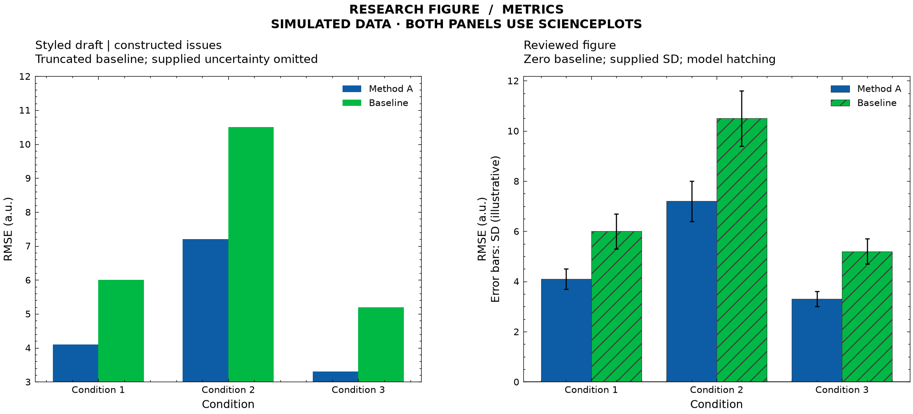
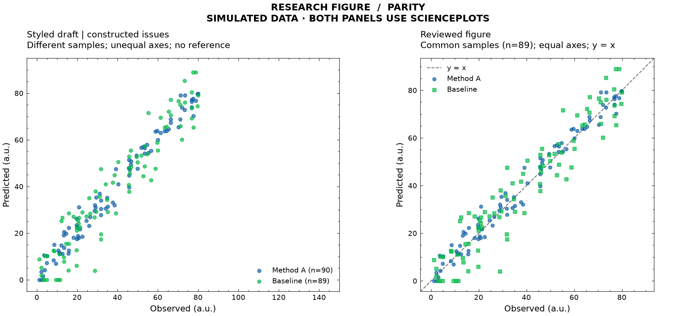
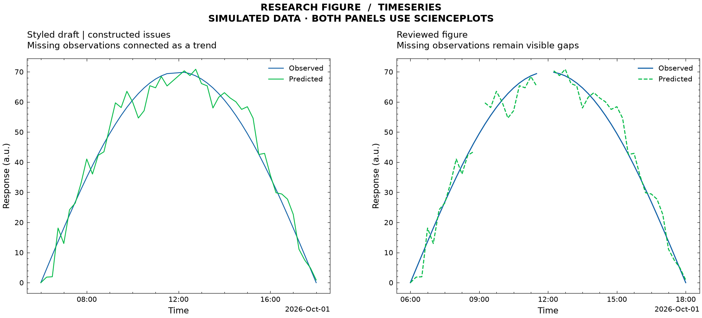

# 科研图表审查案例

使用同一份模拟数据构造有缺陷的草稿，再调用本项目绘图入口修订。两侧均使用 SciencePlots，展示数据与表达检查在样式之外的作用。

左侧问题由 `render.py` 有意构造；右侧直接调用 `skills/research-figure/scripts/plot_csv.py` 的绘图函数。该案例是可复现的规则演示，不是某个模型独立完成任务的成功率测评，也不是对其他产品默认输出的对比。

## 任务输入

适用于这些案例的用户请求：

```text
使用 research-figure 审查这些实验图及原始数据。
核对坐标范围、样本口径、缺失处理和误差线定义。
指出问题位置与依据，保留原始数值，交付修订图、绘图代码和处理记录。
```

## 指标对比



**输入：** [CSV](../metrics/data.csv)、[配置](../metrics/config.json)。三个条件、两种方法；RMSE 和 SD 均为演示值。

| 审查发现 | 依据 | 修订 |
|---|---|---|
| 左侧纵轴从 3 开始，柱长不再对应数值比例 | [R03](../../skills/research-figure/references/review-rules.md)：柱图保留零点 | 纵轴包含 0；保持所有柱值不变 |
| 已提供 SD，但草稿未展示且未解释其含义 | D03：分开表达汇总值与不确定性 | 展示已有 SD，明确标为示例值，不计算或编造区间 |
| 方法主要靠颜色区分 | R08：增加非颜色区分 | 加入纹理 |

最后一组数值为 3.3 与 5.2。截断后可见柱长比为 `(5.2−3)/(3.3−3)≈7.33`，原值比为 `5.2/3.3≈1.58`。这是**柱长比例的失真**，不是模型性能提升比例或统计显著性结论。

## 预测对比



**输入：** [CSV](../parity/data.csv)、[配置](../parity/config.json)。90 行模拟样本，基线缺少一个预测值。

| 审查发现 | 依据 | 修订 |
|---|---|---|
| 草稿按各模型有效行分别绘制，样本数为 90 和 89 | D01/D02：核对比较对象与缺失口径 | 两个模型均使用 89 个共同有效样本，记录排除 CSV 第 6 行 |
| 两轴范围不同且未保持等比例 | R02：纵横比不能改变同量纲比较印象 | 等范围、等比例，并加 `y=x` |
| 两种模型使用相同点形 | R08 | 使用圆点与方点 |

样本问题依据 CSV 与绘图代码核验。仅提供截图时不能确定这一点；审查结果应将其列为待核验项。

## 时间序列



**输入：** [CSV](../timeseries/data.csv)、[配置](../timeseries/config.json)。预期采样间隔 15 分钟。

| 审查发现 | 依据 | 修订 |
|---|---|---|
| 草稿删除空预测值后连线，跨过缺失观测 | D02：显式保留缺口 | 保留缺失值对应的断线，不做插值 |
| 11:30 与 12:15 之间缺少 11:45、12:00 两条记录 | D01/D02：结合已知间隔核对缺口 | 在时间缺口断线，记录缺口后的 CSV 行号 |
| 两条序列仅靠颜色区分 | R08 | 同时使用实线与虚线 |

程序检查有限原始值在修订图中被完整保留。断线表达“这里缺少观测”，不表示数值在该时段下降为零。

## 验证与复现

从仓库根目录执行，使用已经安装依赖的 Python：

```bash
.venv/bin/python examples/review-case/render.py --output work/review-case-new
```

输出目录必须尚不存在。每个案例输出 PNG、PDF、SVG；`evidence.json` 记录输入散列及已检查的数值与图形属性。仓库保留的 [验证记录](evidence.json) 仅含相对路径。

脚本实际检查：柱值与零基线、误差线对象、共同样本数、散点比例、`y=x`、有限观测值保留及原文件未修改。规则解释和排版仍需结合图像查看；这些断言不是完整科研审查。

## English summary

These synthetic fixtures contain deliberate presentation defects. Both columns use SciencePlots; reviewed panels call the actual skill renderer. Cases cover truncated bar baselines, omitted supplied uncertainty, inconsistent prediction samples, unequal axes and hidden time gaps.

Run the command above to reproduce all figures and an evidence JSON containing relative input paths, hashes and checks. This is an instructional example, not a model benchmark. Shared-source values are preserved; the prediction example intentionally restricts both models to the same 89 finite rows and records the excluded CSV row.
